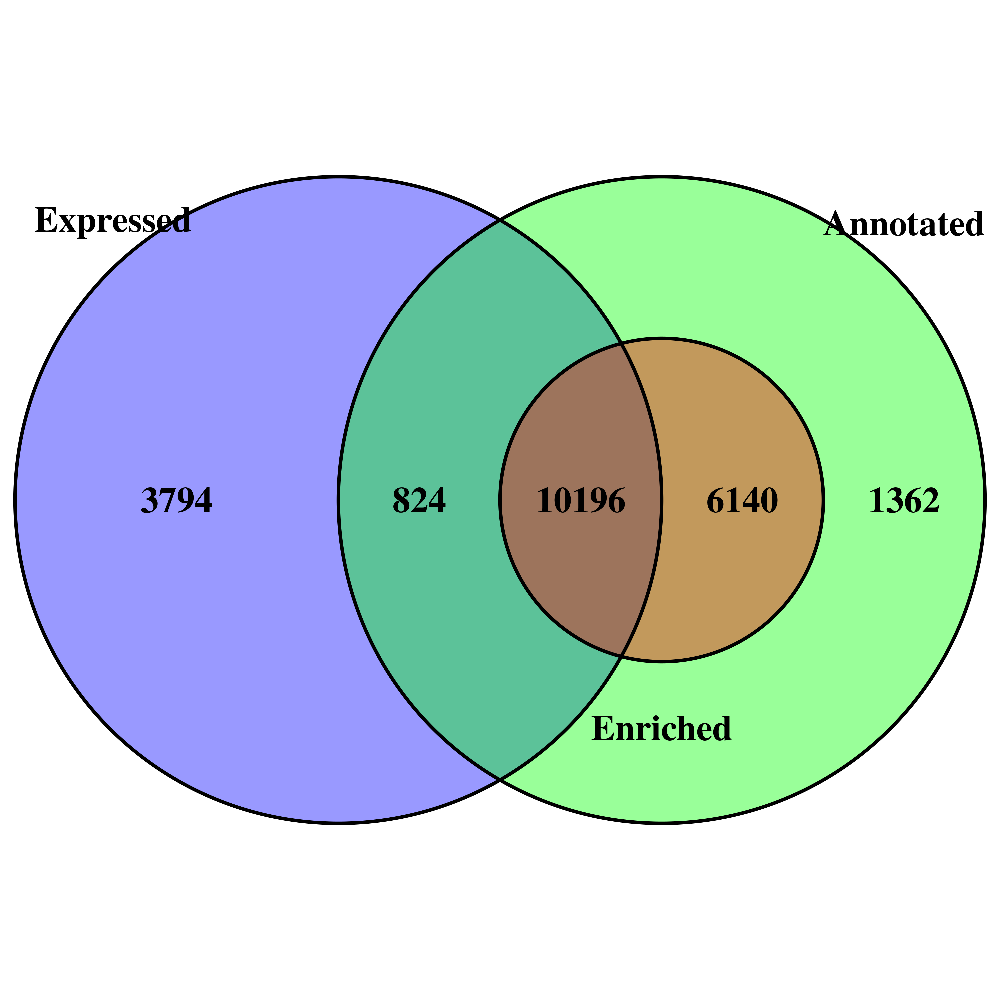

<style type="text/css">
    body {
    max-width: 100%;
    overflow-x: auto;
    font-family: Helvetica;
    font-size: 12pt;
    }
    h1 {
    font-size: 20pt;
    font-weight: bold;
    }
    h2 {
        font-size: 18pt;
        font-weight: bold;
    }
    h3 {
        font-size: 16pt;
        font-weight: bold;
    }
    h4 {
        font-size: 14pt;
        font-weight: bold;
    }
    code {
        font-family: monospace;
        font-size: 11pt;
    }
</style>

```{r include=FALSE}
knitr::opts_chunk$set(echo = TRUE, warning = FALSE, message = FALSE)
knitr::opts_knit$set(root.dir = here::here())  # Must be the project directory
```

```{r message=FALSE, warning=FALSE, include=FALSE}
# Run A2 to generate the required data
rmarkdown::render("./A2_Jielin_Yang.Rmd")
```

# Introduction

## Background

Heart failure (HF) is a chronic cardiac disease with complex pathophysiology 
with profound implications in the patient's quality of life. The progressively
degenerating myocardium is a major hallmark of HF, which is accompanied by
cardiac fibrosis. [@garoffolo2022reduction] [@porter2009cardiac] [@tallquist2017redefining]
Therefore, the identification of profibrotic pathways is essential to the
understanding the pathophysiology of HF and the development of therapeutic
strategies to delay or even to prevent the profibrotic remodelling of the heart.

The Hippo pathway is a conserved signalling pathway that regulates cell
proliferation, cell survival, and cell migration. [@mia2019hippo] It has been
previously discovered that a central component of this pathway, the YAP/TAZ
complex, is dysregulated upon mechanimal stimulation of the cytoskeleton. 
[@elosegui2017force] [@panciera2017mechanobiology] [@brusatin2018biomaterials]
Interestingly, heart failure is usually accompanied by mechanical stress due to 
the malfunctioning of the pumping capability of the heart. Therefore, the
direct suppression of the YAP/TAZ complex may be a potential therapeutic
approach to suppress the proliferation of pro-fibrotic cells and to prevent
the profibrotic remodelling of the heart. [@garoffolo2022reduction] Recently, 
[Garoffolo et al.](https://www.ahajournals.org/doi/10.1161/CIRCRESAHA.121.319373) 
investigated the use of a small molecular inhibitor, verteporfin (VTP) in
cardiac stromal cells, an important precursor to cardiac fibroblasts, to 
suppress the YAP/TAZ complex with or without the presence of TGF-β1, a 
profibrotic cytokine under the maximal strain condition.

## Objectives

In the present analysis, we aim to use RNA-seq data to identify the changes in
the transcriptional profile of cardiac stromal cells after the use of VTP. As
shown in [Figure 1.](#fig1), the transcriptome was assessed by comparing the
addition of VTP with the control with or without the presence of the profibrotic
cytokine, TGF-β1. [@saadat2021pivotal] Upon the identification of differentially
expressed genes, we aim to perform gene set enrichment analysis (GSEA) and
network analysis to access the enriched pathways and using it to infer the
molecular mechanisms underlying the effects of VTP on cardiac stromal cells.

<a name="fig1"></a>


**Figure 1.** Schematics of RNAseq experiment design. Samples were cultured under 
maximal mechanical strains. Six independent cell cultures were used for each 
treatment condition. cSt-Cs: cardiospheres-derived primitive cardiac stromal 
cells; VTP: verteporfin; TGF-β1: transforming growth factor beta-1. Figure 
adapted from [Assignment 1](https://github.com/bcb420-2023/Jielin_Yang/blob/main/Dataset%20selection%20and%20initial%20processing/Assignment_1_Data_cleaning_and_identifier_mapping.html) 
and created with BioRender.com.

## Dataset

The data used in the present analysis is retrieved from the GEO database under 
the accession number [GSE203358](https://www.ncbi.nlm.nih.gov/geo/query/acc.cgi?acc=GSE203358). 
The dataset contains RNA-seq data from 24 samples, which are evenly split into 4 
groups:

- Control (maximal strain condition)
- Verteporfin (VTP) treatment (maximal strain condition)
- TGF-β1 treatment (maximal strain condition)
- Verteporfin (VTP) treatment with TGF-β1 (maximal strain condition)

## Previous Analysis

### Data Normalization

Upon filtering out genes with low counts, the dataset is 
composed of `14814` genes and `24` samples. The reference genome used is the 
human [GRCh38](https://useast.ensembl.org/Homo_sapiens/Info/Index?db=core).

The dataset was normalized using the Trimmed Mean of M-values (TMM) method 
implemented by the [edgeR](https://bioconductor.org/packages/release/bioc/html/edgeR.html) 
package. [@robinson2010edger] After applying normalization, the library size for 
each sample has been effectively adjusted such that the distribution of gene 
expressions are comparable across samples.

### Cluster Analysis

Samples were clustered based on transcriptional similarity. multidimensional
scaling analysis indicates distinct separation based on treatment conditions,
with the most highly distinguishable cluster of samples in the control group,
without profibrotic TGF-β1 treatment. Additional hierarchical clustering with
heatmap further supports that the control group has the most distinguishable
transcriptome, with few samples having similar expression patterns with the 
other groups. VTP treatment are found to alter the transcriptional profile 
to an high extent, but its effect is less prominent when combined with TGF-β1.
In addition, the samples show moderate to low degree of clustering based on the 
cell culture replicates, suggesting that the variation between samples are less
driven by the intrinsic biological variation between the cell cultures.

### Differential Expression Analysis and Preliminary ORA

Differential gene expression analysis was performed using the `edgeR` package. 
[@robinson2010edger] [Figure 2.](#fig2) shows the volcano plot of the differentially
expressed genes (DEGs) between the control and VTP treatment groups, with the
top enriched GO: Biological Process terms in the significantly downregulated 
genes. In this analysis, `r nrow(deg_vtp_ctrl)` genes are found to be differentially
expressed between the control and VTP treatment group, without the presence of
TGF-β1. Among these genes, `r nrow(deg_vtp_ctrl[deg_vtp_ctrl$logFC > 0,])` are
significantly upregulated and `r nrow(deg_vtp_ctrl[deg_vtp_ctrl$logFC < 0,])` are
significantly downregulated. Many of the downregulated genes are collagen genes,
which are a major component of the extracellular matrix (ECM) and are involved
in the profibrotic remodelling of the heart. [@garoffolo2022reduction] The top
enriched GO: Biological Process terms are also consistent with such findings, 
showing pathways in cell adhesion and ECM organization. However, when TGF-β1 is
added, the effect of VTP is much less pronounced, with only `r nrow(deg_vtp_tgf)`
genes being differentially expressed. 

<a name="fig2"></a>

```{r fig.height=4, fig.width=10, echo=FALSE, fig.align="center"}
# Replot the dot plot from assignment 2 with only the top 5 enriched GO terms
# in the significantly downregulated genes
gobp_downreg_5 <- gs_downreg_10[1:5,]
dot_plot_down <- ggplot2::ggplot(gobp_downreg_5) + 
                ggplot2::geom_point(ggplot2::aes(x = gene_ratio, 
                            y = reorder(stringr::str_wrap(Term, 20), gene_ratio),
                            color = FDR,
                            size = Fold.Enrichment)) +
                ggplot2::theme_bw() +
                ggplot2::theme(axis.text.x = ggplot2::element_text(size = 10),
                               axis.text.y = ggplot2::element_text(size = 10),
                               axis.title.x = ggplot2::element_text(size = 10),
                               axis.title.y = ggplot2::element_text(size = 10)) +
                ggplot2::scale_color_gradient(low = "red", high = "blue") +
                ggplot2::labs(x = "Gene Ratio", y = NULL,
                              color = "FDR", size = "Fold Enrichment")

# Replot the dot plot from assignment 2 with only the top 5 enriched GO terms
# in the significantly upregulated genes
gobp_upreg_5 <- gs_upreg_10[1:5,]
dot_plot_up <- ggplot2::ggplot(gobp_upreg_5) + 
                ggplot2::geom_point(ggplot2::aes(x = gene_ratio, 
                            y = reorder(stringr::str_wrap(Term, 20), gene_ratio),
                            color = FDR,
                            size = Fold.Enrichment)) +
                ggplot2::theme_bw() +
                ggplot2::theme(axis.text.x = ggplot2::element_text(size = 10),
                               axis.text.y = ggplot2::element_text(size = 10),
                               axis.title.x = ggplot2::element_text(size = 10),
                               axis.title.y = ggplot2::element_text(size = 10)) +
                ggplot2::scale_color_gradient(low = "red", high = "blue") +
                ggplot2::labs(x = "Gene Ratio", y = NULL,
                              color = "FDR", size = "Fold Enrichment")

# Replot the volcano plot from assignment 2
vol_plot <- ggplot2::ggplot(results_vtp_ctrl, aes(logFC, -log(FDR, 10))) +
    ggplot2::geom_point(aes(color = Expression), size = 2/5) +
    xlab(expression("log"[2]*"FC")) + 
    ylab(expression("-log"[10]*"FDR")) + 
    ggplot2::scale_color_manual(values = c("Up-regulated" = "firebrick3", 
                                           "Down-regulated" = "dodgerblue3", 
                                           "Not DE" = "gray50")) +
    ggplot2::guides(color = ggplot2::guide_legend(override.aes = list(size=1.5))) +
    ggrepel::geom_label_repel(data = genes_to_label, 
                        mapping = aes(logFC, -log(FDR, 10), label = rownames(genes_to_label)),
                        size = 2.5, color = "black", nudge_x = 0.1, nudge_y = 0.1)

# Draw the plots
cowplot::plot_grid(vol_plot, dot_plot_down, ncol = 2, labels = "AUTO")
```

**Figure 2.** Differentially expressed genes and enriched GO: Biological Process terms
in the significantly downregulated genes. (A) Volcano plot of the differentially
expressed genes between the control and VTP treatment groups in the absence of
TGF-β1. Important genes are labelled, with most collagen genes found to be 
downregulated. (B) Dot plot of the top 5 enriched GO: Biological Process terms
in the significantly downregulated genes.


# Preparations

## Package Dependencies

The current R Notebook assumes that it is being run on the BCB420-2023 base image. 
Additional packages required are noted below. For reproducibility we list all packages
we used in the analysis, including utility packages. The GSEA and Cytoscape softwares
with the EnrichmentMap pipeline are also required for the analysis, but they are
run manually outside of the R Notebook.

```{r message = FALSE, tidy=TRUE, warning=FALSE, message=FALSE}
# ggplot2 package for creating plots
if (! requireNamespace("ggplot2", quietly = TRUE)) {
  install.packages("ggplot2")
}
# cowplot package for arranging plots
if (! requireNamespace("cowplot", quietly = TRUE)) {
  install.packages("cowplot")
}
# ggrepel package for plotting text with minimal overlap
if (! requireNamespace("ggrepel", quietly = TRUE)) {
  install.packages("ggrepel")
}
# stringr package for string manipulation
if (! requireNamespace("stringr", quietly = TRUE)) {
  install.packages("stringr")
}
# fgsea package for gene set enrichment analysis and GMT file manipulation
if (! requireNamespace("fgsea", quietly = TRUE)) {
  BiocManager::install("fgsea")
}
# VennDiagram package for creating Venn diagrams
if (! requireNamespace("VennDiagram", quietly = TRUE)) {
  install.packages("VennDiagram")
}
# ComplexHeatmap package for creating heatmaps
if (! requireNamespace("ComplexHeatmap", quietly = TRUE)) {
  BiocManager::install("ComplexHeatmap")
}
# circlize package for heatmap color schemes
if (! requireNamespace("circlize", quietly = TRUE)) {
  BiocManager::install("circlize")
}
# dplyr package for data manipulation
if (! requireNamespace("dplyr", quietly = TRUE)) {
  install.packages("dplyr")
}
# DT package for creating interactive tables
if (! requireNamespace("DT", quietly = TRUE)) {
  install.packages("DT")
}

# Load the packages
library("dplyr")
library("ggplot2")

# We will consistently use package::function() to avoid confusion
# However, the dplyr package has to be loaded first to allow
# definitions of various operators such as %>%
```

## Data Preparation

Since our current analysis is dependent upon the differential gene expression
analysis from assignment 2, we will load the data from the previous assignment.

```{r message = FALSE, tidy=TRUE, warning=FALSE}
# Load the differential gene expression analysis results from assignment 2

# Comparison between control and VTP without TGF-β1
deg_vtp_ctrl <- read.csv("./Data/dge_vtp_ctrl.csv", row.names = 1,
    header = TRUE, stringsAsFactors = FALSE, check.names = FALSE)

# Comparison between control and VTP with TGF-β1
deg_vtp_tgf <- read.csv("./Data/dge_vtp_tgf.csv", row.names = 1,
    header = TRUE, stringsAsFactors = FALSE, check.names = FALSE)
```

The data we just loaded are produced from the `topTags` function in the `edgeR`
package, which returns the log fold change, unadjusted p-value, and adjusted
p-value (FDR) for each gene.

# Gene Set Enrichment Analysis (GSEA)

We will perform GSEA on the differentially expressed genes between the control
and VTP treatment groups with and without the addition of TGF-β1 separately,
and compare the GSEA result with the over representation analysis (ORA) result
obtain previously from assignment 2.

## Effect of VTP treatment in the absence of TGF-β1

### Data Preparation

<a name="gseaprep"></a>

First, we aim to assess the effect of VTP treatment in the absence of TGF-β1 on
cardiac stromal cells by identifying its top enriched pathways. Since GSEA is a
non-threshold method, the use of a ranked list of genes without an arbitrarily
defined threshold allows the assessment of all genes in the list. The ranking of
the genes is integrates the sign of fold change change, and
the statistical significance of the change. [@subramanian2005gene] Since it has 
been suggested that 
GSEA is more consistent in identifying enriched gene sets and pathways, it is 
a preferable method to ORA for analyzing the two sets of differential gene 
expression results under two different conditions. [@abatangelo2009comparative]

We will generate a ranked list of genes as an input to the GSEA software. The
rank of each gene is calculated by the negative of log10 of the PValue by the 
sign of the logFC.

```{r message = FALSE, tidy=TRUE, warning=FALSE}
# Add row names as a column for naming purpose
deg_vtp_ctrl$GeneName <- rownames(deg_vtp_ctrl)

# Constructing ranked gene list
deg_vtp_ctrl$rank <- (- log(deg_vtp_ctrl$PValue, base = 10)) * sign(deg_vtp_ctrl$logFC)
deg_vtp_ctrl_ranked <- dplyr::select(deg_vtp_ctrl, GeneName, rank) %>% 
    arrange(desc(rank)) %>%
    dplyr::select(GeneName, rank)

# Save the ranked gene list
write.table(deg_vtp_ctrl_ranked, file = "./Data/vtp_ctrl.rnk", sep = "\t", 
        col.name = TRUE, row.names = FALSE, quote = FALSE)
```

### GSEA Analysis

<a name="gseaana"></a>

Gene set enrichment analysis (GSEA) was performed using the GSEA software (version
4.3.2) with the previously defined ranked gene list. We performed GSEA using the
predefined `GSEAPreranked` mode, which employs a default gene set permutation to
generate a null distribution of enrichment scores. [@subramanian2005gene] The
p-value of the enrichment is calculated using the Kolmogorov–Smirnov statistic,
with multiple hypothesis correction using FDR method. [@subramanian2005gene] [reimand2019pathway]
We performed GSEA analysis with the following parameters:

* Number of permutations: 1000
* Max size: 200
* Min size: 15

where `max size` and `min size` represent upper and lower bounds on the size of
the gene sets to be included in the analysis. Setting this threshold allowed
us to identify the pathways that are sufficiently specific for the interpretation 
of its biological function.

Since we are interested in understanding the effect of VTP treatment of the 
fibrotic phenotype/progression of the cardiac stromal cells, we are mainly
interested in understanding the biological processes that may be involved
in this process. Therefore, we used the most recent (March 2023) version of 
the `Human_GOBP_AllPathways_no_GO_iea_March_02_2023_symbol.gmt` gene set,
curated by the Bader Lab at the University of Toronto, available 
[here](http://download.baderlab.org/EM_Genesets/March_02_2023/Human/symbol/). 
[@reimand2019pathway] We specifically selected the gene set that does not 
contain annotations inferred from electronic annotations (IEA). This is to
ensure a high confidence inference of the biological processes from GSEA. The 
`gmt` file has been previously downloaded for [prior analysis](https://github.com/bcb420-2023/Jielin_Yang/wiki/GSEA). 
In this annotation file isc curates all GO: Biological Process terms as well as
pathways from multiple pathway databases, including Reactome, WikiPathways,
MSigDB. [@gillespie2022reactome] [@slenter2018wikipathways] [@liberzon2011molecular]
These annotation data should provide us an sufficient understanding of the enriched
biological responses to VTP treatment.

We use the following R code to run GSEA analysis.

```{r message = FALSE, tidy=TRUE, warning=FALSE}
# Configuring the GSEA software

# Path to the GSEA software
gsea_exe <- "/home/rstudio/projects/Jielin_Yang/GSEA_4.3.2/gsea-cli.sh"
# GSEA directory
gsea_dir <- "./Data/VTPControl/"
# Path to the gene set GMT file
gsea_gmt <- "./Data/Human_GOBP_AllPathways_no_GO_iea_March_02_2023_symbol.gmt"
# Path to the ranked gene list
gsea_rnk <- "./Data/vtp_ctrl.rnk"
# Permutations
perm <- 1000
# Max size
max_size <- 200
# Min size
min_size <- 15
# Analysis name
analysis_name <- "VTPControl"
```

```{r message = FALSE, tidy=TRUE, warning=FALSE}
# Download the GMT file if not available
if (!file.exists(gsea_gmt)) {
    gmt_url <- "http://download.baderlab.org/EM_Genesets/March_02_2023/Human/symbol/Human_GOBP_AllPathways_no_GO_iea_March_02_2023_symbol.gmt"
    download.file(gmt_url, destfile = gsea_gmt)
}
```

```{r message = FALSE, tidy=TRUE, warning=FALSE, eval=FALSE}
# Running GSEA
cmd <- paste(gsea_exe, "GSEAPreranked", 
            "-gmx", gsea_gmt, 
            "-collapse false", 
            "-nperm", perm, 
            "-rnk", gsea_rnk,
            "-scoring_scheme weighted",
            "-rpt_label", analysis_name,
            "-plot_top_x 20 -rnd_seed 12345",
            "-set_max", max_size, 
            "-set_min", min_size, 
            "-zip_report false", 
            "-out", gsea_dir)
system(cmd)
```

### GSEA Results

<a name="gseactrl"></a>

Since we performed GSEA manually (details discussed in the [journal](https://github.com/bcb420-2023/Jielin_Yang/wiki/Gene-Set-Enrichment-and-Network-Analysis)), 
we will import the results from the `GSEA` software.

```{r message = FALSE, tidy=TRUE, warning=FALSE}
# Import GSEA results for VTP vs Control
# Since R is having problem correctly parsing the tab in the tsv files, we have
# manually converted the results into a csv file to change the delimiters
# Detailed description documented in the journal
vtp_ctrl_gsea_upreg <- read.csv(
    "./Data/VTPControl/gsea_report_for_na_pos_1680318768172.csv", 
    header = TRUE)
vtp_ctrl_gsea_downreg <- read.csv(
    "./Data/VTPControl/gsea_report_for_na_neg_1680318768172.csv", 
    header = TRUE)
```


Our GSEA analysis identified ``r nrow(vtp_ctrl_gsea_upreg)`` out of `5256` 
specified gene sets associated with the upregulated genes in the VTP treatment 
condition. Of these, ``r sum(vtp_ctrl_gsea_upreg$FDR.q.val < 0.25)`` gene 
sets were significantly enriched (FDR < 0.25) with an average enrichment score
of ``r round(mean(vtp_ctrl_gsea_upreg$ES[vtp_ctrl_gsea_upreg$FDR.q.val < 0.25]), 2)``.
This signficance threshold was chosen in accordance with the default GSEA setting.
[@subramanian2005gene] 

[Table 1](#tab:1) shows the enriched gene sets with the corresponding enrichment
score and FDR q value. The top enriched processes are related to mitocondrial
functions, including mitochondrial translation as well as biological processes 
related to ribosomal functions. The enriched biological processes shows that 
the VTP treatment may be associated with an dystregualtion of metabolic processes
in the cells. 

<a name="tab1"></a>

```{r message = FALSE, tidy=TRUE, warning=FALSE}
# Filter and prepare the table for display
upreg_table <- vtp_ctrl_gsea_upreg %>% 
    dplyr::select(NAME, SIZE, ES, FDR.q.val) %>%
    dplyr::rename("Gene Set" = NAME, "Size" = SIZE, 
                  "Enrichment Score" = ES, "FDR q-value" = FDR.q.val) %>%
    # Extract the gene set name, round the enrichment score and FDR q-value
    dplyr::mutate(`Gene Set` = stringr::str_remove(`Gene Set`, "%.*$")) %>%
    # Convert the gene set name to sentence case
    dplyr::mutate(`Gene Set` = stringr::str_to_sentence(`Gene Set`)) %>%
    # Sort the table by FDR q-value
    dplyr::arrange(`FDR q-value`) %>%
    # Select significantly enriched gene sets
    dplyr::filter(`FDR q-value` < 0.25)

# Display the table
DT::datatable(upreg_table, rownames = FALSE, filter = "top", 
    options = list(ppageLength = 10, scrollX = TRUE)) %>%
    # Changing the font size of content
    DT::formatStyle(names(upreg_table), fontSize = "12px")
```

**Table 1.** Enriched gene sets in the upregulated genes under VTP treatment.


Furthermore, GSEA has also identified ``r nrow(vtp_ctrl_gsea_downreg)`` gene sets 
associated with the downregulated genes in the VTP. Of these, ``r sum(vtp_ctrl_gsea_downreg$FDR.q.val < 0.25)``
gene sets were significantly enriched (FDR < 0.25). The average enrichment score
for these downregulated gene sets is ``r round(mean(vtp_ctrl_gsea_downreg$ES[vtp_ctrl_gsea_downreg$FDR.q.val < 0.25]), 2)``.
There are more enriched gene sets identified in the downregulated genes compared
to the upregulated genes, which is expected since VTP is an inhibitor of the 
transcritpional activator complex YAP/TAZ. [@garoffolo2022reduction]
As shown in [Table 2](#tab:2), the top enriched gene sets are related to integrin
and collagen formaiton pathways. Since both are major components of the extracellular
matrix as well as cell adhesion, these enrichment results suggest that the VTP
has an effect on downregulating the processes involved in fibrosis formation.

<a name="tab2"></a>

```{r message = FALSE, tidy=TRUE, warning=FALSE}
# Filter and prepare the table for display
downreg_table <- vtp_ctrl_gsea_downreg %>% 
    dplyr::select(NAME, SIZE, ES, FDR.q.val) %>%
    dplyr::rename("Gene Set" = NAME, "Size" = SIZE, 
                  "Enrichment Score" = ES, "FDR q-value" = FDR.q.val) %>%
    dplyr::mutate(`Gene Set` = stringr::str_remove(`Gene Set`, "%.*$")) %>%
    dplyr::mutate(`Gene Set` = stringr::str_to_sentence(`Gene Set`)) %>%
    dplyr::arrange(`FDR q-value`) %>%
    dplyr::filter(`FDR q-value` < 0.25)

# Display the table
DT::datatable(downreg_table, rownames = FALSE, filter = "top", 
    options = list(ppageLength = 10, scrollX = TRUE)) %>%
    DT::formatStyle(names(downreg_table), fontSize = "12px")
```

**Table 2.** Enriched gene sets in the downregulated genes under VTP treatment.

### Comparative analysis of GSEA and ORA

<a name="gseacomp"></a>

[Figure 3](#fig:3) illustrates the top enriched gene sets identified by GSEA and ORA,
respectively for the up- and down-regualted genes. Qualitatively, the results
from the two analysis are similar in terms of the top enriched gene sets.
Both types of analysis identified dysregulation of mitochondrial functions in 
the top enriched gene sets. However, ORA reveal additional terms relating to
cellular responses to stress and external stimuli, which are either not identified
or has a comparatively lower enrichment score and significance value in GSEA. 
This may be due to the fact that when we performed ORA, we specificially limited
the genes to have a fold change of at least 2 
([Yang J. BCB420 Assignment 2](https://github.com/bcb420-2023/Jielin_Yang/blob/main/A2_Jielin_Yang.html)). 
Putting such a limit may have
resulted in the increased proportion of genes relating to cellular stress response,
allowing ORA to identify these terms as top enriched gene sets. On the other hand,
both analyses revealed a consistant enrichment of gene sets related to collagen
formation and ECM remodeling in the downregulated genes. Since VTP is an inhibitory
drug that targets a specific activator complex, the resulting inhibitory effect
is expected to be more prominent than the stimulatory effect. Therefore, having
both types of analyses showing a consistant enrichment in downregulated genes
not only indicates that the VTP has an effect on downregulating the processes
involved in fibrosis formation, but also provides a more robust evidence that
reveals the consistency of the two types of analysis when using dataset showing
a clear and strong differential expression.


<a name="fig3"></a>

```{r message = FALSE, tidy=TRUE, warning=FALSE, fig.align="center", fig.width=10, fig.height=7}
# Top 5 enriched gene sets of upregulated genes, GSEA
gsea_up <- ggplot2::ggplot(upreg_table[1:5,], aes(x = `Enrichment Score`, 
    y = stringr::str_wrap(`Gene Set`, 20))) +   
    geom_bar(stat = "identity",) +
    labs(x = "Enrichment Score", y = NULL) +
    theme_minimal() +
    theme(axis.line.x = element_line(),
        axis.text.x = element_text(size = 10),
        axis.text.y.left = element_text(size = 10),
        axis.text.y = element_text(hjust = 0))

# Top 5 enriched gene sets of downregulated genes, GSEA
downreg_table$`Gene Set` <- gsub("_", " ", downreg_table$`Gene Set`)  # Replace underscore with space
gsea_down <- ggplot2::ggplot(downreg_table[1:5,], aes(x = -`Enrichment Score`, 
    y = stringr::str_wrap(`Gene Set`, 20))) +   
    geom_bar(stat = "identity",) +
    labs(x = "Enrichment Score (absolute value)", y = NULL) +
    theme_minimal() +
    theme(axis.line.x = element_line(),
        axis.text.x = element_text(size = 10),
        axis.text.y.left = element_text(size = 10),
        axis.text.y = element_text(hjust = 0))

# We have previously generated the plot for the ORA results in Assignment 2,
# and we reuse it for clear comparison
cowplot::plot_grid(dot_plot_up, gsea_up, dot_plot_down, gsea_down, 
    ncol = 2, nrow = 2, labels = "AUTO", rel_heights = c(1, 1))
```

**Figure 3.** Top 5 enriched gene sets identified by GSEA and ORA for the up- 
(A, B) and down-regulated (C, D) genes. Results from previous ORA was shown in
A and C, with colour of the dots indicates significance level, and the size indicates
the fold enrichment. B, D illustrate the top 5 enriched gene sets identified by
GSEA, with the enrichment score on the x-axis. All GSEA results are coloured
the same as all gene sets has a FDR q-value of 0 (up to the maximum signficant figure).

However, such qualitative comparason between the results from GSEA and ORA
are neither straitforward nor conclusive. In this case, we have to compare top
enriched gene sets to access the consistency between the most significant results.
However, in both types of analysis, both the order of the significance value as 
well as the effect sizes (enrichment score and fold enrichment. respectively)
also critically effect our interpretation of the results. By qualitatively
comparing them, it is unlikely for human eyes to identify the hierarchical
structure returned by the two types of analysis, especially when it comes to
gene sets beyond the first few top enrichments.


## Effect of VTP treatment under TGF-β1

<a name="gseatgf"></a>

Since the authors of the original publication also investigated whether the effect
of VTP is preseved even under the profibrotic environment, we also performed
GSEA based on the differential gene expression analysis results comparing the
VTP-treated cardiac stromal cells and control under TGF-β1 treatment. 

### Data Preparation

While there are not many differntially expressed genes in this dataset,
we calcualted the rank of each gene similarly to the previous analysis.

```{r message = FALSE, tidy=TRUE, warning=FALSE}
# Add row names as a column for naming purpose
deg_vtp_tgf$GeneName <- rownames(deg_vtp_tgf)

# Constructing ranked gene list
deg_vtp_tgf$rank <- (- log(deg_vtp_tgf$PValue, base = 10)) * sign(deg_vtp_tgf$logFC)
deg_vtp_tgf_ranked <- dplyr::select(deg_vtp_tgf, GeneName, rank) %>% 
    arrange(desc(rank)) %>%
    dplyr::select(GeneName, rank)

# Save the ranked gene list
write.table(deg_vtp_tgf_ranked, file = "./Data/vtp_tgf.rnk", sep = "\t", 
        col.name = TRUE, row.names = FALSE, quote = FALSE)
```

### GSEA Analysis

Similarly, we performed GSEA analysis using the same parameters as the previous
analysis, except that this time we use the `vtp_tgf.rnk` gene list for the analysis.
Only a few parameters needs to be changed. 

```{r message = FALSE, tidy=TRUE, warning=FALSE, eval=FALSE}
# Change parameters

# Rank file
gsea_rnk <- "./Data/vtp_tgf.rnk"
# GSEA directory
gsea_dir <- "./Data/VTPTGF/"
# Analysis name
analysis_name <- "VTPTGF"

# Run GSEA
cmd <- paste(gsea_exe, "GSEAPreranked", 
            "-gmx", gsea_gmt, 
            "-collapse false", 
            "-nperm", perm, 
            "-rnk", gsea_rnk,
            "-scoring_scheme weighted",
            "-rpt_label", analysis_name,
            "-plot_top_x 20 -rnd_seed 12345",
            "-set_max", max_size, 
            "-set_min", min_size, 
            "-zip_report false", 
            "-out", gsea_dir)
system(cmd)
```

### GSEA Result 

```{r message = FALSE, tidy=TRUE, warning=FALSE}
# Import GSEA results for up and down regulated genes under TGF-β1 treatment
# Similarly, we have manually converted the GSEA results to a csv file for proper import
gsea_vtp_tgf_up <- read.csv("./Data/VTPTGF/gsea_report_for_na_pos_1680319898865.csv",
    header = TRUE)
gsea_vtp_tgf_down <- read.csv("./Data/VTPTGF/gsea_report_for_na_neg_1680319898865.csv", 
    header = TRUE)
```

[Figure 4](#fig4) summarizes the top enriched gene sets in the up- and down-
regulated genes under TGF-β1 treatment. In this case, the top enriched gene sets
for both up- and down-regulated genes are consistent with the GSEA result without
the presence of TGF-β1. In summary, ``r nrow(gsea_vtp_tgf_up)`` gene sets are
enriched in the up-regulated genes, with ``r sum(gsea_vtp_tgf_up$FDR.q.val < 0.25)`` 
of them being significant. For down-regualted genes, ``r sum(gsea_vtp_tgf_down$FDR.q.val < 0.25)``
out of ``r nrow(gsea_vtp_tgf_down)`` enriched gene sets are found to be signifiant.

<a name="fig4"></a>

```{r message = FALSE, tidy=TRUE, warning=FALSE, fig.align="center", fig.width=10, fig.height=4}
# Filter the top 5 enriched gene sets, retain only fields of interest
gsea_vtp_tgf_up <- gsea_vtp_tgf_up[1:5, c("NAME", "ES", "FDR.q.val")]
gsea_vtp_tgf_down <- gsea_vtp_tgf_down[1:5, c("NAME", "ES", "FDR.q.val")]

# Extract the gene set names and convert to sentence case
gsea_vtp_tgf_up$NAME <- stringr::str_remove(gsea_vtp_tgf_up$NAME, "%.*$") %>%
    stringr::str_to_sentence()
gsea_vtp_tgf_down$NAME <- stringr::str_remove(gsea_vtp_tgf_down$NAME, "%.*$") %>%
    stringr::str_to_sentence()

# Plot the top 5 enriched gene sets
gsea_vtp_tgf_up <- ggplot2::ggplot(gsea_vtp_tgf_up, aes(x = ES, y = NAME)) +   
    geom_bar(stat = "identity") +
    geom_text(aes(x = 0.01, y = NAME, label = NAME), size = 5, hjust = 0) +
    labs(x = "Enrichment Score", y = "Term") +
    theme_minimal() +
    theme(axis.line.x = element_line(),
        axis.text.x = element_text(size = 11),
        axis.text.y = element_blank())

gsea_vtp_tgf_down <- ggplot2::ggplot(gsea_vtp_tgf_down, aes(x = -ES, y = NAME)) +
    geom_bar(stat = "identity") +
    geom_text(aes(x = 0.01, y = NAME, label = NAME), size = 5, hjust = 0) +
    labs(x = "Enrichment Score (absolute value)", y = "Term") +
    theme_minimal() +
    theme(axis.line.x = element_line(),
        axis.text.x = element_text(size = 11),
        axis.text.y = element_blank())

# Combine the two plots
cowplot::plot_grid(gsea_vtp_tgf_up, gsea_vtp_tgf_down, ncol = 2, labels = "AUTO")
```

**Figure 4.** Top 5 enriched gene sets under TGF-β1 for A) up- and B) down-
regulated genes with VTP treatment. The length of the bars represent the
absolute value of the enrichment score, and the gene set names are shown
on the bars.


Further examination on the result reveals that the enriched terms computed
by GSEA are consistent between the two datasets (with and without TGF-β1). Since
GSEA calculates enrichment score based on the ranking of the genes, it follows
that the ranking in both cases are similar. [@reimand2019pathway] [@subramanian2005gene]
Although in the presence of TGF-β1, there are only a few differentially expressed
genes, the difference between the GSEA result with the previous ORA analysis,
which returned no enriched gene set, reveals that GSEA is a more sensitive measure
to detect functional enrichment of the genes. Thus, GSEA is not limited to the
lack of differentially expressed genes, and it can reveals the global change in
the pattern of gene expression once VTP treatment is applied, despite to a smaller
effect. Therefore, GSEA varifies that under TGF-β1 treatment, VTP treatment still
induces an overall antifibrotic change on the transcriptome of the cardiac 
stromal cells.

Since the GSEA analysis result reveals a consistent pattern of functional enrichment
in both datasets (with and without TGF-β1), we will focus our analysis on the
enrichment results without TGF-β1 treatment. This would allow us to concentrate
on potential pathways that are significantly dysregualted by VTP treatment, and 
having a clearly defined set of differentially expressed genes would further allow
us to perform a robust network analysis.

# Network Analysis

## Network Construction

<a name="netcons"></a>

As detailed in the [journal](https://github.com/bcb420-2023/Jielin_Yang/wiki/Gene-Set-Enrichment-and-Network-Analysis#network-analysis),
we have tried to run EnrichmentMap from within R, but we have encountered several
issues. The `RCy3` package was unable to establish a connection with Cytoscape
from within Docker, and if we run R directly on the host machine, syntax errors
exist that current version of the Cytoscape/EnrichmentMap plugin may use a slightly
different syntax than the version in which the [tutorial](https://baderlab.github.io/Cytoscape_workflows/EnrichmentMapPipeline/Protocol2_createEM.html#28_Create_an_Enrichment_map) was written. Therefore,
we have decided to run Cytoscape manually from the GUI.

The following thresholds were used to construct the network:

```{r message = FALSE, tidy=TRUE, warning=FALSE, eval=FALSE}
# Thresholds for gene set nodes
pval_threshold <- 1
qval_threshold <- 0.05
# Thresholds for edges
cutoff <- 0.375   # default for combined similarity score with Jaccard + Overlap
metric <- "COMBINED"
# Network parameters
network_name <- "VTP_ctrl_network"
gsea_result <- "./Data/VTPControl/edb/"
gsea_result_file <- file.path(gsea_result, "results.edb")
gsea_rank_file <- file.path(gsea_result, "vtp_ctrl.rnk")
```

As recommended by the authors of EnrichmentMap, we used a more stringent FDR q-value
threshold for the gene sets nodes in comparison to the 0.25 threshold used by GSEA.
Since VTP is a drug that targets a specific pathway involving gene transcription, 
it is expected that the pathways affected by VTP treatment are more specific.
Therefore, we used a comparatively stringent threshold to isolate the important
genes sets that are significantly affected by VTP treatment. An initial set up
using 0.05 is also not very stringent to filter out potential pathways that are
affected as side effects of VTP treatment. The cutoff for the combined similarity
score is set to 0.375, which used an combination of the Jaccard and Overlap similarity
and is left as default for intial observation of the network. [Figure 5](#fig5) illustrates
the network constructed using the above parameters prior to manual formatting.
This initial network has 663 nodes with 4627 edges.

<a name="fig5"></a>


**Figure 5.** Enrichment map of the dysregualted gene sets and pathways under
VTP treatment in the absence of profibrotic cytokine TGF-β1. Red and blue nodes
represent VTP and control phenotype pathways, which are up- and down-regulated
pathways upon VTP treatment, respectively. Node sides correspond to gene set size,
and edge width corresponds to the combined similarity score.

## Network Optimization and Analysis

<a name="netopt"></a>

However, the intial network shows a number of gene sets that are not very well
connected to the rest of the network (as shown in the bottom of [Figure 5](#fig5)). This
represents that these gene sets may be involved in a relatively independent
processes and thus are not very useful for extracting the major biological themes
in the network. In addition, after cross-referening with the list of enriched pathways
from GSEA (Table 1 and 2), we notice that these gene sets are not found to be the
most significantly enriched or having a large enrichment score. Therefore, to better
extract and define the major biological themes altered by VTP treatment, we
futher limited the FDR q-value threshold to 0.01 and manually formatted such that
the pathways corresponding to each phenotype are grouped together.

[Figure 6](#fig6) shows the topology of the network after manual formatting. For
pathways of each phenotype, we applied the `Prefused Force Directed Layout` to 
visualize the network based on the similarity coefficients between the nodes. [@shannon2003cytoscape]
The size of the nodes were annotated to reflect the gene set size, with the colour
of node boarder reflecting the normalized enrichment score (NES).

<a name="fig6"></a>


**Figure 6.** Topology of the enrichment map of the dysregualted gene sets under
VTP treatment in the absence of profibrotic cytokine TGF-β1. Network was created
with parameters FDR Q-value threshold < 0.01 and combined similarity cutoff > 0.375.
Nodes were laied out with the `Prefused Force Directed Layout` algorithm following
slight manual formatting to reduce node overlap. Annotation was performed as
shown in the legend.


However, understanding the topology of the network alone is not enough to interpret
the biological themes of the network. Therefore, we focused on the clustering of 
highly interconnected gene sets and applied semantic annotations to extract the
major biological themes this network represents. The Cytoscape plugin `AutoAnnotate`
was used for this purpose. [@kucera2016autoannotate] Futher manual adjustment on
the summarized annotations was performed to accurately annotate the theme of a 
cluster. Manual formatting was also applied to clearify the network, allowing for
better interpretation of detailed pathways. [Figure 7](#fig7) shows the the 
product of the above processes.

<a name="fig7"></a>


**Figure 7.** Enrichment network with major biological themes extracted. A) Overall 
thumnail of the publication-ready network created with parameters FDR Q-value < 0.01
and combined similarity cutoff > 0.375. Biological themes were extracted using the
`AutoAnnotate` plugin and manually clearified. B) Detailed view of the top
enriched clusteres of the network. Red and blue nodes represent VTP and control
phenotype pathways, which are up- and down-regulated pathways affected by VTP
treatment in cardiac stromal cells. Node sizes correspond to gene set size, coloured
by normalized enrichment score (NES). The size of annotation text corresponds to
the number of gene sets annotated to the theme.

To better visualize the relationships between the biologial theme clusters, we
further collaposed the clusters into a single node and applied the `Force Directed
Layout` algorithm to visualize global themes of the network. A combined analysis
using [Figure 7](#fig7) and [Figure 8](#fig8) would allow better interpretation.

<a name="fig8"></a>


**Figure 8.** Collapsed network of major biological themes. Each node represents
a collapsed cluster of biological themes. Node sizes correspond to the number of
gene sets annotated to the theme. Red and blue nodes represent up- and down-regulated
pathways affected by VTP treatment. An edge exists between two nodes if any gene set
annoated under the biological theme share common genes with combined similarity
coefficient > 0.375.

<a name="netanal"></a>

As expected from the initial analysis, the number of major biological themes discovered
are more in the downregulated pathways by VTP treatment. Since VTP is an inhibitory
drug, we would expect that it targets active transcriptional complexes downstream
of the YAP/TAZ transcriptional co-activators, which are known  to be involved in
multiple cellular processes. [@xin2011regulation] [@totaro2018yap] Additionally,
previous studes has revealed different pathways (either cytosolic or nuclear) that
are altered due to direct molecular interactions with VTP. [@wang2016verteporfin]
[@wei2020verteporfin] Although our analysis did not reveal detailed mechanism, 
the enriched biological themes in the downregulated pathways are consistent with
previous reports, suggesting that the direct effect of VTP on YAP/TAZ are likely
cell-type independent. Yet, the major theme we observed in the downregulated pathways
is related to collagen formation and ECM organization. Although the human heart
remains the most non-regenerative organ, the cardiac interstitial cells, including
cardiac fibroblasts and stromal cells (the focus of this study), are shown to have
a large proliferative potential. [@picchio2022dynamic] [@floy2020human] This phenotype
also explains the observed fibrotic remodeling during heart failture. Hence, 
although VTP may mediate an cell-type independent molecular interaction, its effect
on cell proliferation and phenotypical change are likely cell-type specific,
revealing a positive effect in reducing the formation of profibrotic structures.

Interstingly, the major biological themes in the upregulated pathways are less
understood. As shown in [Figure 7](#fig7) and [Figure 8](#fig8), the largest 
theme are protein sysnthsis and damage response. Although we have seen an enriched
translation-related pathways from the GSEA result, the observation of an fully 
upregulated pathway from amino acid synthesis to translation is newly discovered
via the network. Since VTP has been an FDA-approved drug, changes in the transcriptome
beyond the targeted molecular pathways can be considered as a side effect. Toxicity
study has shown that VTP can induce the formation of cross-linked protein oligomers,
which are toxic to the cell. [@konstantinou2017verteporfin] Therefore, in conjunction
with the major increase in translation-related pathways, we hypothesize that the
upregulation in damage response pathways, as well as stress-related pathways
(observed in ORA analysis from Assignment 2), may be a result of the toxic effect
of VTP on the cell.


# Dark Matter

Verteporfin (VTP) is a photodynamic therapy (PDT) drug that has been approved by
the FDA and have been investigated on the treatment of various cancers. [@huggett2014phase]
[@feng2016verteporfin] Among these applications, VTP has been shown to be effective
in mediating cancer cell death by inducing apoptosis via its anti-proliferative
effect in inhibiting the YAP/TAZ complex and its cytotoxic effect due to the 
observed protein-cross linking as discussed previously. [@dasari2017verteporfin]
[@konstantinou2017verteporfin] However, these treatment replies on the direct effect
of VTP to inhibit cancer cells, whereas in our analysis, the application of VTP
is to prevent the fibrotic progressiom of cardiac stromal cells. Despite the 
negative consequence of profibrotic remodeling, these cardiac interstitial cells
are still important to mediate the normal cardiac function. Therefore, the potential
side effect of VTP on the cardiac stromal cells is of great concern.

In our previous analysis, we hae idntified the major biological themes in the
up- and down-regulated pathways affected by VTP treatment. However, it is also
important to note any dysregualted genes and pathways that are not captured
by the GSEA and network analysis. Here, we further examine the "dark matters"
to access any potential side effect of VTP on the cardiac stromal cells.

## Identifying Dark Matter Genes

First, we obtain all gene sets and genes with annotation in the GMT file. [@korotkevich2016fast]

```{r message = FALSE, tidy=TRUE, warning=FALSE}
# Load the gene sets in the GMT file
gene_sets <- fgsea::gmtPathways(gsea_gmt)
# Get the collection of all genes having annotation
anno_genes <- unique(unlist(gene_sets))
```

Then, we obtain all gene sets and genes in the enrichment result. We have
previously imported the enrichment result for the up- and down-regulated genes
when performing GSEA analysis. The results are stored in the `vtp_ctrl_gsea_upreg`
and `vtp_ctrl_gsea_downreg` variables.

```{r message = FALSE, tidy=TRUE, warning=FALSE}
# List of enriched gene sets
gene_sets_enriched <- c(vtp_ctrl_gsea_upreg$NAME, vtp_ctrl_gsea_downreg$NAME)

# List of all genes in the enriched gene sets
genes_enriched <- unique(unlist(gene_sets[gene_sets_enriched]))
```

Finally, we obtain the set of genes that in our expression dataset.

```{r message = FALSE, tidy=TRUE, warning=FALSE}
# Read the differential expression results
dge_vtp_ctrl <- read.csv("./Data/dge_vtp_ctrl.csv", header = TRUE, row.names = 1)

# List of all genes in our dataset
query_genes <- rownames(dge_vtp_ctrl)
```

Our expression data set comparing the effect of VTP treatment to control contains
a total of ``r length(query_genes)`` genes. By examining the enrichment results
and the source annotation file, we found that there are ``r length(genes_enriched)``
genes in the enrichment results, out of which ``r length(anno_genes)`` have
annotation.

```{r message=FALSE, warning=FALSE, include=FALSE, tidy=TRUE}
# Define the Venn Diagram parameters
genes <- list(
  "Enriched" = genes_enriched,
  "Annotated" = anno_genes,
  "Expressed" = query_genes
)
colors <- c("#FF0000", "#00FF00", "#0000FF")

# Plot the Venn Diagram
VennDiagram::venn.diagram(
    genes,
    fill = colors,
    imagetype = "png",
    filename = "./images/venn.png",
    alpha = 0.4,
    label.col = "black",
    cex = 1.3,
    fontface = "bold",
    cat.cex = 1.3,
    cat.fontface = "bold",
    )
```

<a name="fig9"></a>

```{r message=FALSE, warning=FALSE, tidy=TRUE, fig.align="center", out.width="50%"}
# Import and display the Venn Diagram png file

```

**Figure 9.** Venn Diagram showing the overlap between the expressed genes in the
dataset, genes in the enriched gene sets, and genes with annotation. Enriched
genes are completely enclosed in the set of annotated genes, while ``r length(setdiff(query_genes, genes_enriched))``
out of ``r length(query_genes)`` genes in the dataset are not found in any 
enriched genes sets, and out of which ``r length(setdiff(query_genes, anno_genes))``
have no annotation.

The Venn Diagram reveals that there are significant number of genes that are 
not found in any of the enriched gene sets, or having any annotation. The scale
of non-annoated genes is out of expectation. Since in our annotation, we specified
the GO terms to have no IEA terms for high-quality mapping, but it is likely that
many of our dysregulated genes are not annotated in the base GO database. Additionally,
in our previous analysis in [Assignment 1](https://github.com/bcb420-2023/Jielin_Yang/blob/main/Dataset%20selection%20and%20initial%20processing/Assignment_1_Data_cleaning_and_identifier_mapping.html), we found that the original expression 
dataset is curated using a mixture of NGNC symbols and GenBank ID. These IDs are
not curated of high quality due to having different version of genes treated as
different genes, and some of which are not even valid GenBank IDs with version.
Hence, it is also likely that the ID mapping is not of the best quality. Therefore,
we will explore the genes that are not found in the enriched gene sets or having
annotation manually examine the genes to assess their functions.

## Genes Not Found in Enriched Gene Sets

We first analyze the genes that are not found in the enriched gene sets.

```{r message = FALSE, tidy=TRUE, warning=FALSE}
# Set of genes not found in enriched gene sets
genes_not_enriched <- setdiff(query_genes, genes_enriched)

# Read the gene rank file
gene_rnk <- read.table(gsea_rnk, header = TRUE, sep = "\t")

# We now obtain the rank of the genes not found in enriched gene sets
genes_not_enriched_rank <- gene_rnk[gene_rnk$GeneName %in% genes_not_enriched,]
```

<a name="tab3"></a>
```{r message = FALSE, tidy=TRUE, warning=FALSE}
# Visualize the genes
DT::datatable(genes_not_enriched_rank, 
    options = list(pageLength = 10, autoWidth = TRUE)) %>%
    DT::formatStyle(colnames(gene_rnk), fontSize = "12px") %>%
    DT::formatStyle(0, fontSize = "12px")
```

**Table 3.** Genes and associated ranks that are not found in any enriched gene
sets. The genes are sorted by rank in descreasing order. Top genes desplayed are
found to be upregulated. The table is interacive, and the list can be sorted in 
ascending order by rank. This way the table displays the top downregulated genes.

The result shows that there are two genes among the top 10 upregulated genes in
the dataset. The two genes are `SPRYD3` and `ERV3-1`. Manual searching for the 
genes reveals that they do not have strong evidence for their functions. `SPRYD3`
is only predicted to be involved in cell surface receptor signaling pathway and 
cytoskeleton organization according to the latest [Entrenz annotation](https://www.ncbi.nlm.nih.gov/gene/84926#summary).
The Gene Ontology database also did not store any annotation for the gene.

Therefore, despite the highly significant differential expression, we are not able
to obtain the function on some of such genes due to the lack of annotation.
We further examine the general expression pattern of such genes across the samples.

```{r message = FALSE, tidy=TRUE, warning=FALSE}
# Extract the genes not found in enriched gene sets that are significantly
# differentially expressed
genes_not_enriched_dge <- dge_vtp_ctrl[genes_not_enriched, ] %>%
    dplyr::filter(FDR < 0.05)
```

There are ``r nrow(genes_not_enriched_dge)`` genes that are not found in any
enriched gene sets, but are significantly differentially expressed. We now
visualize them using a heatmap in [Figure 10](#fig10) to assess their expression pattern using the
ComplexHeatmap and circlize packages. [@gu2016complex] [@gu2014circlize]

```{r message = FALSE, tidy=TRUE, warning=FALSE}
# Define the heatmap matrix for these genes
# We directly operate on the matrix created in Assignment 2, which has been
# run implicitly in the previous code chunks
heatmap_matrix_not_enrich <- heatmap_matrix[rownames(genes_not_enriched_dge), 
                            grepl("\\.VTP|\\.CTRL", colnames(heatmap_matrix))]
```

```{r message = FALSE, tidy=TRUE, warning=FALSE, fig.align="center", fig.width=9}
# Checking the range of the heatmap matrix
hmap_range <- range(heatmap_matrix_not_enrich)

# Set the 3 color palette based on the scaled heatmap matrix
hmap_col <- circlize::colorRamp2(c(hmap_range[1], 0, hmap_range[2]), 
                                 c("blue", "white", "red"))

# Redefine 2 colours for the 2 treatment conditions
treatment_col <- hcl.colors(2, palette = "viridis")
names(treatment_col) <- c("VTP", "CTRL")

# Create an annotation dataframe
anno_df <- data.frame(treatment = sample_matrix_sorted[grepl("\\.VTP|\\.CTRL", 
                                  rownames(sample_matrix_sorted)), "treatment"],
                      culture = sample_matrix_sorted[grepl("\\.VTP|\\.CTRL", 
                                  rownames(sample_matrix_sorted)), "culture"])
anno_col <- list(treatment = treatment_col, culture = culture_col)

# Create the heatmap annotation
hmap_anno <- ComplexHeatmap::HeatmapAnnotation(
                    df = anno_df,
                    col = anno_col)

# Since we use k-means clustering to better separate the set of up- and
# downregulated genes, for reproducibility we set the seed
set.seed(91711)

# Create the heatmap
hmap_enrich <- ComplexHeatmap::Heatmap(heatmap_matrix_not_enrich,
                                    show_row_dend = TRUE,
                                    show_column_dend = TRUE,
                                    show_column_names = TRUE,
                                    show_row_names = FALSE,
                                    col = hmap_col,
                                    top_annotation = hmap_anno,
                                    k = 2)
set.seed(NULL)
hmap_enrich
```
<a name="fig10"></a>

**Figure 10.** Heatmap of the expression of genes that are not found in any
enriched gene sets. Samples are annotated based on treatment conditions and 
culture replicates.

The heatmap reveals a clear clustering of the samples based on the treatment
condition, except the `M81` culture. A clear expression pattern of these genes
are observed in most samples, with a small subset of the samples showing
moderate expression of genes in either phenotype.

## Genes with No Annotation

Since we have observed that some of the most highly differentially expressed genes 
that are not found in the enriched gene sets are due to the lack of annotation,
we further examine the subset of such genes that do not have any annotation.

```{r message = FALSE, tidy=TRUE, warning=FALSE}
# Set of genes with no annotation
genes_no_anno <- setdiff(query_genes, anno_genes)

# Significantly differentially expressed genes with no annotation
genes_no_anno_dge <- dge_vtp_ctrl[genes_no_anno, ] %>%
    dplyr::filter(FDR < 0.05)
```

There are ``r length(genes_no_anno)`` genes that have no annotation. Of those,
``r sum(dge_vtp_ctrl[genes_no_anno, "FDR"] < 0.05)`` are significantly
differentially expressed. The genes are similarly visualized in [Table 4](#tab4).

<a name="tab4"></a>
```{r message = FALSE, tidy=TRUE, warning=FALSE}
# Rank of the significantly differentially expressed genes with no annotation
genes_no_anno_rank <- gene_rnk[gene_rnk$GeneName %in% rownames(genes_no_anno_dge),]

# Visualize the genes
DT::datatable(genes_no_anno_rank, 
    options = list(pageLength = 10, autoWidth = TRUE)) %>%
    DT::formatStyle(colnames(gene_rnk), fontSize = "12px") %>%
    DT::formatStyle(0, fontSize = "12px")
```


The most highly upregualted gene is 
`r rnk_no_anno <- gene_rnk[gene_rnk$GeneName %in% genes_no_anno,]`
``r rnk_no_anno[1, "GeneName"]`` on the ``r rownames(rnk_no_anno)[1]`` postion
of the ranked list, which is among the most highly upregulated genes. In addition,
the most highly downregulated gene is ``r rnk_no_anno[nrow(rnk_no_anno), "GeneName"]``,
which is the ``r nrow(gene_rnk) - as.numeric(rownames(rnk_no_anno)[nrow(rnk_no_anno)]) + 1``st
most highly downregulated gene. The result is very intersting. Among the genes
with no annotation, we have observe that the most highly upregulated and downregulated
genes. This suggests that while the evidence from our analysis supports the 
the hypothesis that VTP has a antifibrotic effect, our current analysis may also
miss some additional pathways that are also dysregualted in VTP-treated samples.
We now visualize the expression of these genes in a heatmap in [Figure 11](#fig11).

```{r message = FALSE, tidy=TRUE, warning=FALSE}
# Define the heatmap matrix for these genes
heatmap_matrix_no_anno <- heatmap_matrix[rownames(genes_no_anno_dge), 
                            grepl("\\.VTP|\\.CTRL", colnames(heatmap_matrix))]
```

```{r message = FALSE, tidy=TRUE, warning=FALSE, fig.align="center", fig.width=9}
# Checking the range of the heatmap matrix
hmap_range <- range(heatmap_matrix_no_anno)

# Set the 3 color palette based on the scaled heatmap matrix
hmap_col <- circlize::colorRamp2(c(hmap_range[1], 0, hmap_range[2]), 
                                 c("blue", "white", "red"))

# Create the heatmap
set.seed(91711)
hmap_no_anno <- ComplexHeatmap::Heatmap(heatmap_matrix_no_anno,
                                    show_row_dend = TRUE,
                                    show_column_dend = TRUE,
                                    show_column_names = TRUE,
                                    show_row_names = FALSE,
                                    col = hmap_col,
                                    top_annotation = hmap_anno,
                                    k = 2)
set.seed(NULL)
hmap_no_anno
```

<a name="fig11"></a>

**Figure 11.** Heatmap of the expression of genes that have no annotation. Samples
are annotated based on treatment conditions and culture replicates.

Similar to the heatmap in [Figure 10](#fig10), the heatmap reveals a clear clustering
of the samples based on the treatment condition, except the `M81` culture. Interstingly,
the most observent downregulated genes in the above visualization is `ARL10`. 
Manual searching for the gene reveals that it is a [GTPase](https://www.genecards.org/cgi-bin/carddisp.pl?gene=ARL10&keywords=ARL10) that are related to
multiple transcription factors. Further examination shows that although the gene 
has an [GO annotation](http://amigo.geneontology.org/amigo/gene_product/UniProtKB:Q8N8L6), the data is available from IEA, which we specifically
excluded in our analysis.

Based on the results obtained from analyzing the genes that are not involved in
our previous analysis, it remains inconclusive to determine the side effects
of VTP treatment based on the current evidence. However, using the data available,
we can conclude that VTP treatment has a antifibrotic effect in down-regulating
pathways involved in collagen formation and extracellular matrix remodeling.
Since we have also discovered its potential cytotoxic effect relating to 
protein synthesis and damage, further investigation is needed to properly
understand the safety of using VTP as a therapeutic agent for fribosis treatment.

## Connection to Original publication

<a name="connorig"></a>

The analysis performed here is only part of the global objective of the original
publication. [@garoffolo2022reduction] However, the aim of the present analysis 
is to investigate whether VTP has an antifibrotic effect in cardiac stromal
cells under the profibrotic conditions of mechanical strains. Our analysis supports
the conclusion from the original publication that VTP, which mediates direct
inhibition on the YAP/TAZ transcriptional co-activators, has an antifibrotic
effect. This is supported by the downregulation of genes involved in collagen
formation and extracellular matrix remodeling. These results are also consistent
with the threshold-based analysis performed in Assignment 2. The obervent downregulation
of profibrotic pathways are also consistent with previously reported results that
inhibition of YAP/TAZ complex inhibits fibrosis in both human and mouse models. [@piersma2015signaling] [@zhang2021inhibition]
The antifibrotic effect of VTP has also been reported in other organs. [@shi2021verteporfin]


Yet, when we consider the enrichment results under the presence of the profibrotic
cytokine TGF-β1, the differential gene expression analysis as well as ORA in 
Assignment 2 revealed a much weaker effect of VTP when a strong profibrotic
stimulus is present. Yet in our current anlysis using non-threshold based method,
we observed a similar effect of VTP. This means that despite VTP is weaker in mediating
the process when a profibrotic pathway is stimulated, the antifrobotic effect
is still present, via the same pathways, despite to a lesser extent.

However, it is also intersting to observe the upregulation of vairous pathways 
involved in various stages of protein synthesis, from altering the translational 
machinaries to amino acid synthesis. This is a result that is not reported by 
the original publication. [@garoffolo2022reduction] As discussed previously, 
we have found evidence that VTP has cytotoxic effects via protein cross linking. [@konstantinou2017verteporfin]
The observed cytotoxic effect of VTP as well as this mechanism reported explains
the enrichment of damage related pathways and also provides a feasible explanation
that such damage also arrise from the highly upregualted translational and protein
synthesis pathways. [@dasari2017verteporfin] [@konstantinou2017verteporfin]
Our analysis has provided a new insights into the mechanism of VTP action and its
potential side effects for the treatment of cardiac fibrosis.


# Interpretation and Analysis

## Non-thresholded Gene Set Enrichment Analysis

1. What method did you use? What genesets did you use? Make sure to specify versions and cite your methods.

    See the [preparation](#gseaprep) and [analysis](#gseaana) of GSEA.

2. Summarize your enrichment results.

    See GSEA results for [VTP vs. Control without TGF](#gseactrl) and 
    [VTP vs. Control in the presence of TGF](#gseatgf).

3. How do these results compare to the results from the thresholded analysis in Assignment #2. Compare qualitatively. Is this a straight forward comparison? Why or why not?
   
   See the [comparison](#gseacomp) of GSEA results between thresholded and non-thresholded methods.

## Visualize Gene Set Enrichment Analysis in Cytoscape

1. Create an enrichment map - how many nodes and how many edges in the resulting map? What thresholds were used to create this map?

    The initial network has 663 nodes with 4627 edges. It is constructed under
    the following parameters:

        - FDR < 0.05
        - Combined similarity score > 0.375
    
    For details, see [network construction](#netcons).

2. Annotate your network - what parameters did you use to annotate the network. If you are using the default parameters make sure to list them as well.

    Here, we have modified the parameters to create a better network topology.
    For details, see [network optimization and analysis](#netopt).

3. Make a publication ready figure - include this figure with proper legends in your notebook.

    See [Figure 7](#fig7).

4. Collapse your network to a theme network. What are the major themes present in this analysis? Do they fit with the model? Are there any novel pathways or themes?

    See [Figure 8](#fig8) and associated [analysis](#netanal).

## Interpretation and detailed view of results

1. Do the enrichment results support conclusions or mechanism discussed in the original paper? How do these results differ from the results you got from Assignment #2 thresholded methods?

    This has been discussed in multiple places in the report. See the [GSEA comparison](#gseacomp),
    [network interpretation](#netanal), and the [connection to original publication](#connorig).

2. Can you find evidence, i.e. publications, to support some of the results that you see. How does this evidence support your result?

    Again this is discussed in multiple places in the report. See the my
    [interpretation of the network ](#netanal) and the [remarks on the results](#connorig).


# Journal Link
The link to the concurrent journal entry can be found [here](https://github.com/bcb420-2023/Jielin_Yang/wiki/Gene-Set-Enrichment-and-Network-Analysis).

# References