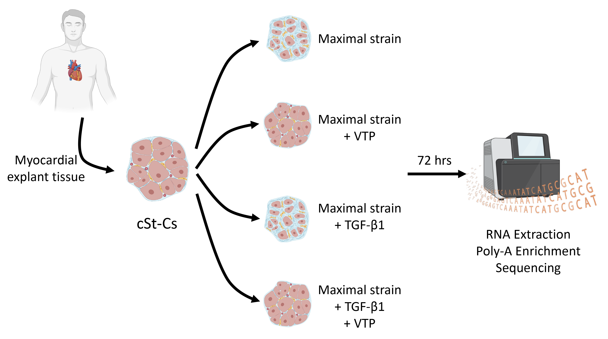

# Introduction
## Background
Heart failure (HF) is one of the most common and life-threatening syndrome 
associated with progressive morbidity and mortality that has implicated over 65 
million patients worldwide in 2017. [@savarese2022global] It is characterized by 
the reduced capacity of the heart to pump sufficient blood to meet the metabolic
demands of the body. The pathogenesis of HF is complex and involves multiple 
factors, but one of the earliest hallmark of the disease is maladaptive
remodelling of the myocardium. [@garoffolo2022reduction] During remodelling, the
damaged cardiomyocytes (which can be resulted from ventricular overload, altered
metabolic composition, etc.) are replaced by fibrotic scar tissues.
 [@porter2009cardiac] [@tallquist2017redefining] The altererd extracellular 
matrix (ECM) increased myocardial stiffness and thus further
contributes to the progression of HF. [@perestrelo2021multiscale] Therefore, the
identification of the key genes and pathways that are involved in profibrotic 
remodeling is critical for the development of novel therapeutic teachniques.

Earlier studies have established a connection between both static and dynamic 
cytoskeletal tension between cells as a result of cellular adhesion to ECM with 
the transactivation of the Hippo signaling pathway. [@brusatin2018biomaterials] 
In particular, it was found that an increased nuclear entry of the YAP/TAZ 
complex, which is a potent transcriptional activator of proliferative genes, is 
a result of the inhibition of the repressive kinease regulators and deformation 
of the nuclear lamina under mechanical strains. [@panciera2017mechanobiology] 
[@elosegui2017force]
Recently, this finding has been extended to myofibroblasts, which are the major 
contributor of cardiac fibrosis derived from the quiescence cardiac stromal cells
. [@francisco2020blockade] Hence, 
[Garoffolo et al.](https://doi.org/10.1161/CIRCRESAHA.121.319373) aims to 
elicidate the connection between the abnormal straining forces in cardiac 
myocardium and the YAP-dependent transcriptional activation in profibrotic 
cells. [@garoffolo2022reduction] In addition, they tested whether direct 
pharmaceutical inhibition of the YAP/TAZ complex with verteporfin (VTP), a known
drug that interfers the binding of YAP to its target TEAD, can attenuate the 
progression of cardiac fibrosis with and without the presence of the potent 
profibrotic cytokine TGF-β1. [@giraud2020verteporfin] [@piersma2015signaling]

## Objectives
The research study aimed to establish the connection between the response of 
human myocardial stromal cells (cSt-Cs) to straining forces and the activation 
of the profibrotic pathway downsteam of YAP/TAZ. In addition, they tested 
whether the inhibition of YAP/TAZ translocation to the nucleus. 
[@garoffolo2022reduction]

Here, we focused on a particular part of the larger objective, where we 
incorporated the RNA sequencing data to differentially compare the molecular 
signitures of the cSt-Cs under known mechanical strains that activate 
profibrotic pathways.
We hope to identify whether the direct inactivation of the YAP/TAZ complex with 
VTP under *in vitro* conditions is able to attenuate the progression of cardiac 
fibrosis, with and without the presence of TGF-β. [@garoffolo2022reduction]

## Data
As documented in the previous [journal](https://github.com/bcb420-2023/Jielin_Yang/wiki/Gene-Expression-Dataset-Selection) 
and [R Notebook](https://github.com/bcb420-2023/Jielin_Yang/blob/main/Data%20set%20selection%20and%20initial%20processing/Gene_Expression_Dataset_Selection.Rmd),
we have performed a search for gene expression datasets that are related to the 
topic of our research project using both the GEOmetadb and the NCBI GEO database.
Upon reviewing the results, we have selected the dataset with the accession number [GSE203358](https://www.ncbi.nlm.nih.gov/geo/query/acc.cgi?acc=GSE203358) for 
further analysis.
This dataset is part of a study that has been published in Circulation Research.
The original publication can be found 
[here](https://doi.org/10.1161/CIRCRESAHA.121.319373).

## Study Summary
### Title
Reduction of Cardiac Fibrosis by Interference With YAP-Dependent Transactivation

### General Experimental Design
To access whether direct inhibition of the YAP/TAZ complex contributes to
anti-fibrotic activities under chronic mechanical strain and profibrotic 
signalling, RNA sequencing was performed in the following way. 
Cardiospheres-derived primitive cardiac stromal cells (cSt-Cs) were derived from
cardiospheres retrieved from human myocardial explant tissues. cSt-Cs were then 
treated with ±verteporfin (VTP) and ±TGF-β1 under *in vitro* culture conditions 
under maximum strain exerted by glass slides.
Total RNA was extracted from each independent cell culture 72 hours after
phamalogical treatments using the Trizol method. RNA library was made following 
enrichment of the polyadenylated mRNAs.

```{r echo = FALSE, fig.align = 'center', out.width = "75%", fig.cap = "Schematics of RNAseq experiment design. Samples were cultured under maximal mechanical strains. Six independent cell cultures were used for each treatment condition. cSt-Cs:  cardiospheres-derived primitive cardiac stromal cells; VTP: verteporfin; TGF-β1: transforming growth factor beta-1. Figure created with BioRender.com."}

```

# Preparations

The current R Notebook assumes that it is being run on the BCB420-2023 base 
image. Additional packages required are noted below.

```{r, message = FALSE, tidy=TRUE}
# BiocManager for installing a set of Bioconductor packages
if (! requireNamespace("BiocManager", quietly = TRUE)) {
  install.packages("BiocManager")
}

# GEOquery package for querying the GEO database
if (! requireNamespace("GEOquery", quietly = TRUE)) {
  BiocManager::install("GEOquery")
}

# Biobase package for Bioconduction base functions
if (! requireNamespace("Biobase", quietly = TRUE)) {
  BiocManager::install("Biobase")
}
```


# Data Download and Initial Characterization

```{r, message = FALSE, tidy=TRUE}
# Download the dataset for GSE203358
if (!file.exists("./Data/GSE203358_count_matrix.txt")) {
  gse203358 <- GEOquery::getGEO("GSE203358", GSEMatrix = FALSE)
  
} else {
  read.table("./Data/GSE203358_count_matrix.txt")
}
gse203358 <- GEOquery::getGEO("GSE203358", GSEMatrix = FALSE)
```

Here we provide a summary of the dataset metadata:
- **Platform:** 
- **Submission date:** 
- **Last update date:** 
- **Organism:** 
- **Number of samples:** 
- **Number of GEO datasets using the same technology, up to `r Sys.Date()`: **


```{r, message = FALSE, tidy=TRUE}
# Checkpoint for data download

```


TODO:
1. For R code chucks, set warnings to false


# References